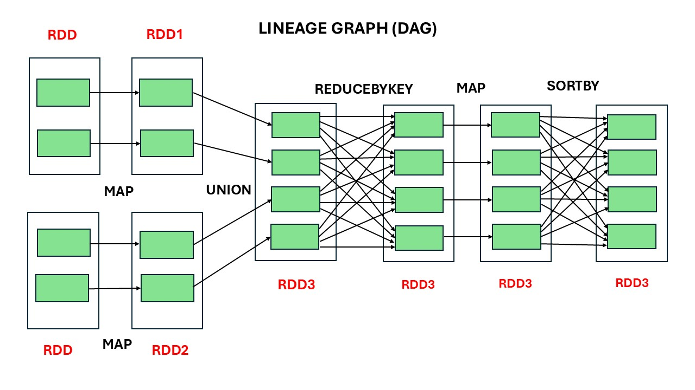
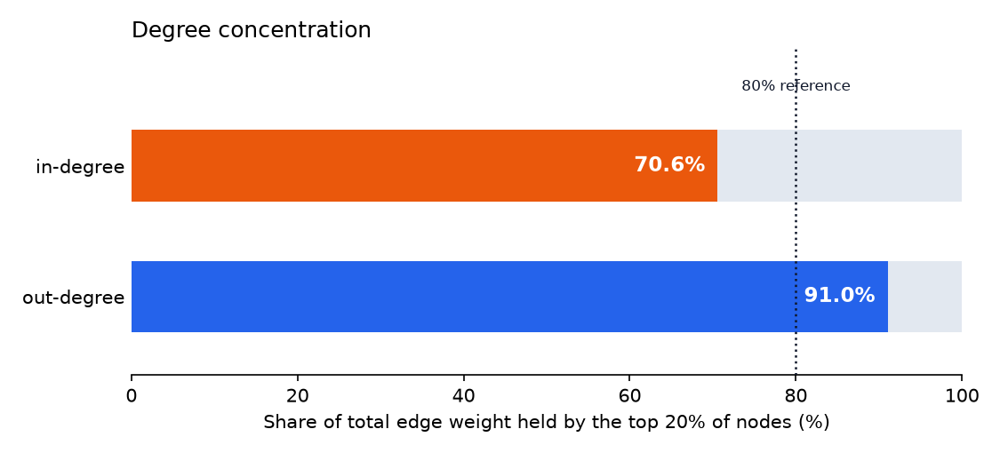
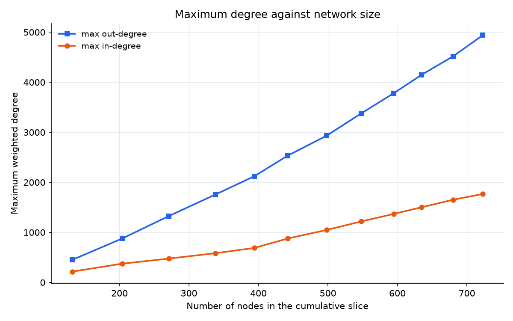
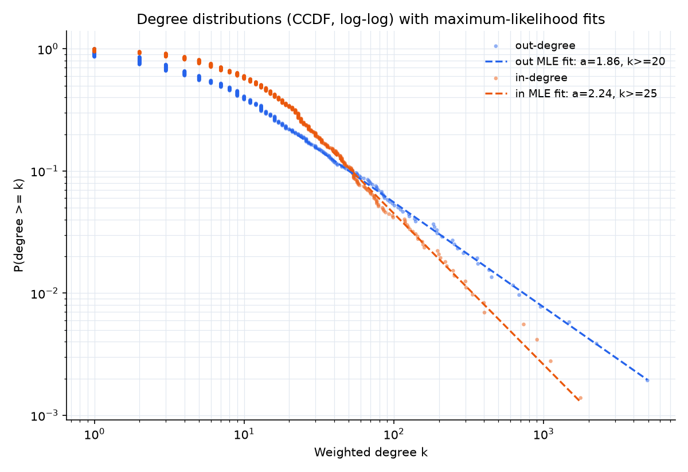

# Enron Email Network Analysis

Distributed processing of a half-million-message email corpus with Apache Spark,
turning raw RFC-822 messages into a weighted directed communication graph and
analysing its structure.

Built with the **Spark RDD API** rather than DataFrames or Spark SQL. That was a
constraint of the original brief and it is kept deliberately: the project is
about reasoning over transformations, partitioning and shuffle boundaries
directly, without a query optimiser in between.

```
raw messages  ->  (sender, recipient, timestamp)  ->  (sender, recipient, weight)  ->  degree stats
   0.5M            43k distinct transmissions          weighted directed graph        + distributions
```

---

## Quick start

Requires Python 3.9+ and a JDK (17 or 21).

```bash
git clone https://github.com/akshaybesarla/enron-email-network-analysis.git
cd enron-email-network-analysis

python -m venv .venv && source .venv/bin/activate
pip install -r requirements.txt

# Generate a synthetic corpus in the same shape as the real one
python -m src.generate_data --messages 20000 --people 1200 --out data/raw

# Build the network and run the analysis
python run_analysis.py --input data/raw --start 2000-01-01 --months 12

pytest          # 19 tests, ~30s
```

Results land in `output/`: `results.json` plus three charts.

### About the data

The original corpus was the public Enron dataset, stored as Hadoop Sequence
Files on a university HDFS cluster. It is not redistributable here, so the repo
ships a **generator** that produces messages in the same RFC-822 shape with a
deliberately heavy-tailed activity distribution. Every address in it is
invented.

To run against real sequence files instead:

```bash
python run_analysis.py --input hdfs:///path/to/enron-full --format sequence
```

---

## The pipeline

### 1. `extract_email_network` — messages to edges

Parses each message, takes `From` as the sender and the union of `To`, `Cc` and
`Bcc` as recipients, and converts the `Date` header to a timezone-aware
`datetime`.

The key operation is `flatMap`: one message with five recipients becomes five
edges, because five transmissions happened. `map` gives one output per input;
`flatMap` is what turns a collection of *messages* into a collection of
*transmissions*.

Three constraints then apply. Both addresses must be valid and inside
`enron.com`, so the graph describes internal communication only. Self-loops are
dropped. The result is `distinct()` — necessary because the same person can
appear in both `To` and `Cc` of one message, which would otherwise count one
transmission twice.

The domain regex anchors `enron.com` as a complete label pair, so
`joe@sales.enron.com` is accepted while `joe@senron.com` and
`joe@notenron.com` are rejected.

### 2. `convert_to_weighted_network` — collapsing to a weighted graph

If A emailed B forty-seven times you have forty-seven near-identical rows. This
collapses them to `(A, B, 47)`.

Mechanically it is word count with a pair as the key:
`map` to `((sender, recipient), 1)` then `reduceByKey`. The optional date range
filters *before* counting, which is what makes every time-sliced analysis below
possible.

### 3. `get_out_degrees` / `get_in_degrees`

Out-degree is total messages sent; in-degree is total received.

The non-obvious part is nodes of degree zero. Someone who only ever receives
mail never appears in the sender column, so a naive aggregation silently drops
them. Every node is seeded with a zero from the opposite column and unioned in
before the reduce — the zeros contribute nothing arithmetically but force the
key to exist.

### 4. `get_out_degree_dist` / `get_in_degree_dist`

Histogram of degrees: how many nodes have degree 5, how many have degree 6. This
is the input to the power-law analysis.

### 5. `get_monthly_contacts`

For each sender, the month in which they contacted the most *distinct people*
(not the most messages). Two aggregation passes, ties preserved.

---

## Execution model



The lineage graph for `get_out_degrees`, assuming two partitions per RDD. Spark
builds this DAG lazily and only executes when an action is called.

| Dependency | Transformations here | Cost |
|---|---|---|
| **Narrow** — each output partition reads one input partition | `map`, `filter`, `union` | Local, no network traffic |
| **Wide** — output partitions read from many input partitions | `reduceByKey`, `sortBy` | Shuffle across the cluster |

Spark cuts the DAG into stages exactly at the wide boundaries. In this function
the two `map`s and the `union` run in one stage; `reduceByKey` forces a shuffle,
and `sortBy` forces another.

---

## Findings

Numbers below are from the **real 0.5M-message corpus**, calendar year 2001.
Running the repo against the synthetic generator gives the same qualitative
picture with different magnitudes.

### Concentration



| | Top 20% share | Pareto (80/20)? |
|---|---|---|
| In-degree | 88% | Yes |
| Out-degree | 99% | Yes, far beyond it |

Both directions are concentrated, outgoing extremely so. A small set of accounts
originate almost all internal mail — consistent with distribution lists and
announcement accounts rather than purely with individual seniority.

### Growth of the maximum degree



Over cumulative monthly slices, the network grew to 16,519 nodes while the
maximum out-degree reached 28,312 and maximum in-degree 4,633. Out-degree grows
**superlinearly** with node count; in-degree grows closer to linearly. That is
the preferential-attachment pattern — already-connected nodes attract
connections faster than the network adds nodes.

### Degree distribution



Plotted as a complementary CDF rather than a raw histogram. A heavy-tailed
histogram has a long run of degree values observed exactly once, which flattens
the tail into a line of 1s and makes any fit look wrong regardless of its
quality. The CCDF needs no binning.

Two estimators, reported side by side:

| | OLS on log-log | MLE with KS-chosen cutoff |
|---|---|---|
| Out-degree | α = 0.62 (R² = 0.65) | **α = 1.86** (k ≥ 20) |
| In-degree | α = 0.82 (R² = 0.70) | **α = 2.24** (k ≥ 25) |

*(figures from the synthetic corpus, where both estimators can be run on the
same data; the real corpus produced α = 0.72 and 1.15 under OLS)*

This gap is the most important result in the project, and it is a result about
method rather than about Enron.

A power law p(k) ∝ k<sup>−α</sup> is only normalisable for **α > 1**. The OLS
fit returns values *below* 1 for both directions — meaning it does not describe
a valid distribution at all. The reason is that fitting a straight line by least
squares to a log-log histogram gives every point equal weight, so the sparse,
noisy tail pulls the slope as hard as the dense head, and nothing constrains the
result to a valid range.

Maximum likelihood with a fitted lower cutoff (Clauset, Shalizi & Newman 2009)
returns 1.86 and 2.24, both valid and both inside the 2–3 band typical of
scale-free networks.

**One caveat on interpretation.** These degrees are *weighted*, so an out-degree
of 28,312 means 28,312 messages sent, not 28,312 distinct contacts. The classic
preferential-attachment result concerns unweighted degree. One account mailing a
distribution list 28,000 times is not "the rich get richer" in the usual sense.
The brief asked for weighted degrees and that is what is computed, but the
scale-free reading should be treated as suggestive rather than established.

---

## Tests

```bash
pytest
```

19 tests. The first reproduces the exact expected output published with the
original brief — six triples from a known sample message — which is the
strongest available check that extraction still behaves to specification. The
rest cover what one sample message cannot: subdomain acceptance and lookalike
domain rejection, self-loop removal, de-duplication across `To`/`Cc`, malformed
and missing dates, date-range slicing, zero-degree node inclusion, sort order
and tie-breaking, and the distinct-people semantics of monthly contacts.

---

## What I would do differently

This began as a university project. Rebuilding it surfaced several things worth
stating plainly.

**The power-law fit was wrong, and the original write-up did not catch it.** The
submitted report gave α = 0.72 and still described the network as scale-free.
Since the brief itself defines the power law as α > 1, that conclusion was not
supported by its own number. The MLE estimator is now implemented alongside the
original OLS so the two can be compared directly, and the README states which
one to believe.

**`groupByKey` was the wrong choice.** `get_monthly_contacts` originally used it
twice. `groupByKey` ships every value across the network before combining;
`aggregateByKey` and `reduceByKey` combine map-side first and shuffle far less.
The second pass also recomputed `max(...)` inside a comprehension, making it
quadratic in months per sender. Both are fixed.

**Error handling assumed clean data.** A single unparseable `Date` header threw
an exception that would kill the whole task on a cluster. Bad records are now
dropped and the job continues.

**No tests existed.** The original was verified by eyeballing printed output
against comments in a driver script. Anything that is going to be changed later
needs an executable check.

**It was not reproducible.** Hard-coded cluster paths meant nobody outside the
university could run it. Hence the generator and the local-text reader.

Still missing, and honest to name: no orchestration, no incremental processing,
no data-quality checks beyond parse validity, and no cloud deployment. Those
belong in a pipeline project rather than in a bolt-on here.

---

## Repository layout

```
src/pipeline.py        The five transformations
src/analysis.py        Concentration, growth, power-law fitting
src/sources.py         Sequence-file and text-directory readers
src/generate_data.py   Synthetic corpus generator
run_analysis.py        CLI entry point, writes results.json and charts
tests/                 19 pytest tests

```

## References

- Clauset, A., Shalizi, C. R., & Newman, M. E. J. (2009). Power-law distributions in empirical data. *SIAM Review*, 51(4), 661–703.
- Klimt, B., & Yang, Y. (2004). Introducing the Enron corpus. *CEAS*.

## License

MIT — see [LICENSE](LICENSE).
